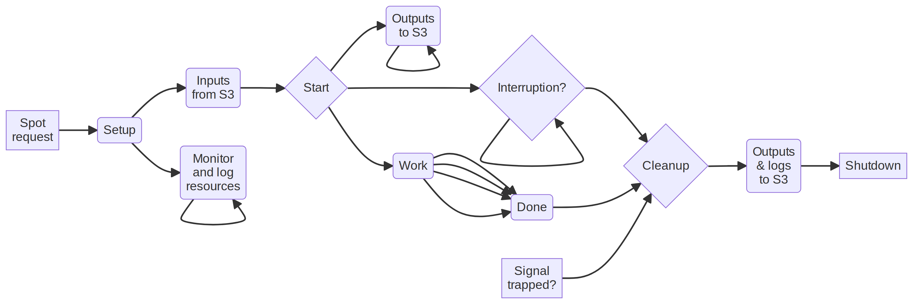

# Simple parallel computation
Angus Gray-Weale
2025-06-11

*This repository is a work in progress. It has been through limited
testing, and requires clearer control of its settings. [Email me if
you’d like access or information about projects and publications that
use this code.](mailto:github.com.h3com@passmail.net)*

This repository provides a set of `bash` scripts that handles simple
parallel execution using GNU Parallel, for example on AWS Spot
instances.

The code has two main uses:

- Run simple parallel calculations on a local or cloud workstation,
  tracking memory use, and load averages. Here a simple parallel
  calculation is the trivial case of independent jobs without
  communication.

- Run the same type of job on an AWS Spot Instance, checking
  periodically for interruption notices as advised by the AWS
  documentation.

Good use is made of `rclone`, GnuPG, GNU Parallel, and GNU Niceload, as
explained below.

For use the code must be modified to include code that runs the jobs.
Unmodified, the `run.sh` script uses `stress` and `dd` to run a dummy
job and generate dummy outputs that aid in design and debugging.

## Possible extensions and improvements

Straightforward extensions of the code include:

- The GNU Parallel command could be replaced by an MPI job running on a
  single node, allowing the other features of this code to be applied to
  a parallel job with inter process communication.

- Similar Spot instances are available from other Cloud server farms.
  With small changes this code could be used with these.

- The code that configures the instance with from a user data script
  would not be necessary if instead a machine image with all necessary
  software were used.

## Projects that use this code

### Supervised classification of natural gas price movements

We use supervised machine-learning methods to predict price changes in
the US Henry Hub market for options on natural gas. Despite increases in
the sizes of price movements for a particular contract as maturity
approaches, we identify stable statistical properties that allow
comparisons of prices at different times, and increase the body of data
used for learning. The predictions are used to assist investment
decisions.

### Multiweek prediction of the state of the northern hemisphere

Imperfect knowledge of the state of the Earth system, combined with
sensitivity to initial state, limits predictions. Useful advanced
warning of extreme weather requires multi-week lead times, as do
decisions on investments sensitive to energy markets. An original
mathematical method, and the design of data structures that describe the
Earth System, reduce the computational complexity and make possible
multi-week predictions not possible with traditional methods.

## Details of operation

The above chart shows the flow of execution from left to right. The
description here follows execution on a Spot instance. Use on a local
machine skips the setup steps and requires only execution of `run.sh`.

1.  A **spot request** is issued using a launch template that includes
    the user data script provided.

2.  The user data script installs necessary packages, keys, and this
    repository. It finishes by executing `run.sh`.

3.  A function runs in the background that periodically logs the
    system’s load averages and memory use. The function checks
    `/dev/shm` for a file containing the ids of all processes started by
    the computation, and records details of these processes, for example
    individual memory use.

4.  Inputs are then moved from their source to a work space using
    `rclone`. This might well just copy the files from somewhere else on
    a local disk, or it might copy them from a remote location such as
    S3. A configuration file for `rclone` must be provided. The
    advantage of using `rclone` is that it can run many transfers in
    parallel and is compatible with a very wide range of data stores.

5.  Optionally, and if appropriate keys have been installed, encrypted
    input files are decrypted.

6.  With the system set up, resources monitored, and input files ready,
    the calculation can begin. Three processes are started:

    1.  A function in the background checks for output files matching a
        given glob, encrypts them if this has been requested, and then
        uses `rclone` to copy them to the output destination. This
        ensures that as many output files as possible have already been
        saved if an interruption notice is received.

    2.  The main script polls for a spot interruption notice, and if one
        is found, triggers the cleanup routine.

    3.  GNU Parallel runs in the background, and executes the `run`
        function for example once for each input file. Extra options may
        be specified for `parallel` using `OPT_PARALLEL`.

7.  The `run` function records processes spawned by the calculation in a
    file on `/dev/shm`, and applies `niceload` to each so that the
    system’s load is under some control.

8.  Signals are trapped and trigger the cleanup routine.

9.  Triggering cleanup encrypts the outputs if this has been requested
    and copies the output files to their destination with `rclone`.

10. If we are using a spot instance the last step is shutdown. The
    instance should be configured to terminate and delete all disks on
    shutdown.
